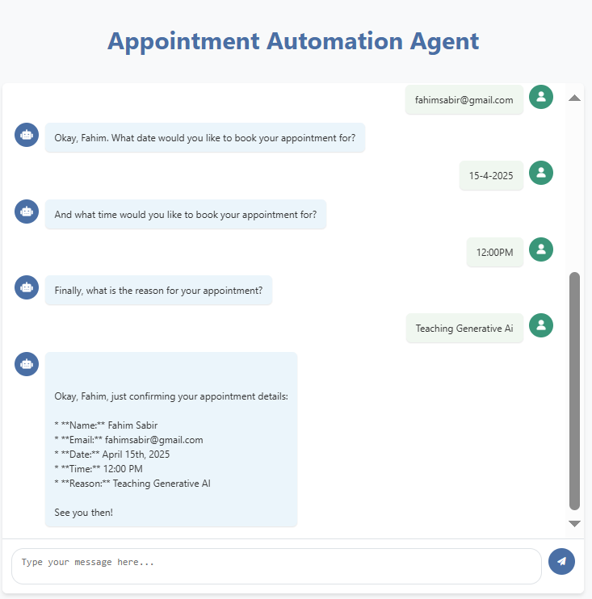

# AI Appointment Booking Assistant

A conversational web application designed to assist users with booking and retrieving appointments using a step-by-step, natural language interface. The application leverages Google Generative AI (Gemini-2.0-flash) via LangChain for processing user input and generating responses, while using SQLite for persistent data storage.

# Features

 * Conversational Interface: Interact with an AI assistant that guides you through booking an appointment.
 * Step-by-Step Appointment Booking: Collects user details including name, email, appointment date, time, and reason.
 * Appointment Retrieval: Allows users to check existing appointment details.
 * Input Validation: Ensures email addresses are in a valid format and checks for duplicate appointments.
 * Database Management: Automatically creates and updates a SQLite database to store appointment records.
 * Friendly Response Formatting: Uses an LLM to generate clear, user-friendly confirmations and appointment summaries.

# File Structure

    .
├── app.py                      # Main Flask application handling routes and sessions.
├── src/
│   ├── helper_func.py          # Contains LLM chain initialization, appointment parsing, and chat processing logic.
│   └── db.py                   # Manages SQLite database operations (insertion, retrieval, and schema setup).
└── templates/
    └── index.html              # HTML template for the web interface.

# Installation

1. Prerequisites:
    * Python 3.7 or higher.
    * A valid Google API key for Gemini (set as the environment variable GEMINI_API_KEY).

2. Clone the Repository:

git clone https://github.com/fahimai001/Booking_Appointments_Automation_Agent.git
cd Booking_Appointments_Automation_Agent

# Create a Virtual Environment (Optional but Recommended):
python -m venv venv
source venv/bin/activate   # On Windows: venv\Scripts\activate

4. Install Required Packages: Ensure you have the necessary dependencies installed. You can install the required libraries using pip. Create a requirements.txt file with the following (adjust versions as needed):

Flask
langchain
langchain_google_genai
dateparser

Then run:
pip install -r requirements.txt

# Database Initialization:

The application automatically creates a database directory and initializes the SQLite database (booking.db) on startup. If the database schema requires updating, the system will alter the table as needed.

# Running the Application
Start the Flask application by executing:

python app.py

